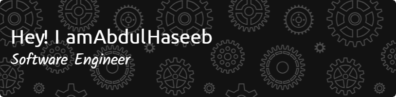

<!-- Futuristic Animated Header -->

  

  

---

## 👨‍💻 About Me

- 🎓 Software Engineering graduate from SMI University, Karachi  
- 👨‍💻 Full-time Flutter Developer  
- 📱 Passionate about building scalable, responsive apps using **Flutter**  
- 🚀 Currently working on production-level apps  
- 🛠️ Focused on clean code, performance optimization, and secure API integration  

---

## 🎓 Education

- 🎓 **BS Software Engineering**  
  *Sindh Madressa-tul-Islam University*, Karachi  
  (2021 - 2025) `Graduated`

- 🧪 **Intermediate in Pre-Engineering**  
  *Nabi Bagh Z.M Govt Science College*, Karachi  
  (2018 - 2020)

- 🖥 **Matric in Computer Science**  
  *True Care Academy*, Karachi  
  (2016 - 2018)

---

## 🛠 Skills & Tools

### Languages & Frameworks

  
  
  
  
  
  
  

### Tools & Platforms

  
  
  
  
  

---

## 📊 GitHub Stats

  

### 💡 Top Languages

  

### 🔥 GitHub Streak

---

## 🏆 GitHub Trophies

  

---

## 📈 Contribution Graph

  

---

## 🌐 Connect with Me

  

---

  

